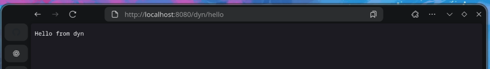
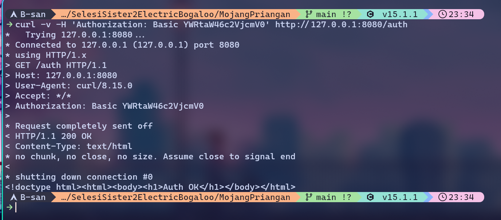

# Dokumentasi HTTP Web Server Assembly (asmhttpd)

Proyek ini adalah sebuah HTTP Web Server fungsional yang ditulis sepenuhnya dalam bahasa Assembly untuk arsitektur x86-64 di lingkungan Linux. Server ini dirancang untuk menjadi ringan, cepat, dan memenuhi semua persyaratan yang ditentukan.

## Arsitektur

Server ini dibuat untuk arsitektur **x86-64 (64-bit)** dan menggunakan system calls (syscalls) Linux secara langsung untuk operasi jaringan dan file. Proses kompilasi menggunakan `nasm` untuk merakit kode Assembly menjadi file objek.

---

## Fitur-Fitur yang Diimplementasikan

### 1. Mendengarkan pada Port Tertentu (Listening to Port)

Server dapat menerima argumen command-line `-p` untuk menentukan port TCP yang akan digunakan. Proses ini melibatkan tiga syscalls utama: `socket`, `bind`, dan `listen`.

**Cara Kerja:**
1.  **`socket()`**: Membuat endpoint komunikasi jaringan dan mengembalikan sebuah file descriptor.
2.  **`bind()`**: Menetapkan alamat (IP dan port) ke file descriptor socket yang telah dibuat.
3.  **`listen()`**: Menandai socket sebagai socket pasif yang akan digunakan untuk menerima koneksi masuk.

**Contoh Menjalankan:**
```bash
# Menjalankan server pada port 8080
./asmhttpd 8080
````

### 2\. Forking Child Process untuk setiap Request

Untuk menangani beberapa koneksi secara bersamaan tanpa saling memblokir, server menggunakan model *pre-forking*. Setelah koneksi diterima oleh `accept()`, proses utama akan membuat proses anak (child) menggunakan syscall `fork()`.

**Cara Kerja:**

1.  Proses induk (parent) berada dalam *infinite loop* dan tugas utamanya hanya memanggil `accept()` untuk menunggu koneksi baru.
2.  Ketika koneksi baru masuk, `accept()` kembali dengan *file descriptor* untuk koneksi tersebut.
3.  Induk segera memanggil `fork()`.
4.  **Proses Anak**: `fork()` mengembalikan 0. Proses anak bertanggung jawab penuh untuk menangani request dari klien, setelah itu ia akan keluar (`exit()`).
5.  **Proses Induk**: `fork()` mengembalikan PID dari anak. Proses induk hanya menutup *file descriptor* koneksi di sisinya dan kembali ke `accept()` untuk menunggu koneksi berikutnya.

### 3\. Parsing HTTP Methods (GET, POST, PUT, DELETE)

Server dapat mem-parsing request line dari klien untuk mengidentifikasi metode HTTP yang digunakan.

**Cara Kerja:**

1.  Request dari klien dibaca ke dalam sebuah buffer.
2.  Kode akan mencari spasi pertama untuk memisahkan nama metode (misalnya, "GET") dari sisa request line.
3.  Nama metode kemudian dibandingkan dengan string yang telah ditentukan (`"GET"`, `"POST"`, dll.) untuk menentukan tindakan selanjutnya.

**Contoh Pengujian:**

```bash
# Uji metode GET
curl -v http://127.0.0.1:8080/
curl -v http://localhost:8080/hello

# Uji metode POST (server akan merespon 200 OK)
curl -v -X POST --data "TONIGHT THE MUSIC SING SO LOUD!" http://127.0.0.1:8080/test_posting.txt
```
Note: Bisa lihat hasil post di directory www/

<!-- ### 4\. Melayani Permintaan File Statis

Server dapat menyajikan file dari direktori lokal yang ditentukan menggunakan argumen `-d`. Ini memungkinkan server untuk mengirimkan file HTML, CSS, JavaScript, gambar, dan lainnya.

**Cara Kerja:**

1.  Path yang diminta dari URL klien (misal: `/style.css`) digabungkan dengan path *document root* (misal: `./www`) untuk membentuk path file lokal (`./www/style.css`).
2.  Server menggunakan syscall `open()` untuk membuka file tersebut.
3.  Ukuran file didapatkan menggunakan `fstat()` untuk mengisi header `Content-Length`.
4.  Syscall `sendfile()` yang sangat efisien digunakan untuk menyalin data dari file descriptor file langsung ke file descriptor socket, menghindari penyalinan data yang tidak perlu ke *user space*.

**Screenshot Pengujian:**
-->

### 5\. Melayani Permintaan Berdasarkan Rute/Path (Routing)

Server mengimplementasikan routing sederhana untuk menangani path tertentu secara khusus, bukan hanya sebagai file statis.

**Cara Kerja:**

  - Path yang telah di-parse akan dibandingkan dengan rute-rute yang telah didefinisikan secara internal.
  - `/hello`: Mengembalikan respons teks `Hello from Assembly!`.
  - `/auth`: Memerlukan Basic Authentication.
  - `/dyn/*`: Meneruskan permintaan ke plugin C eksternal.
  - Jika tidak ada rute yang cocok, server akan mencoba melayani permintaan sebagai file statis.



-----

## Fitur Bonus

### 1\. Integrasi dengan Program Lain (Linking Binary C)

Server ini dapat memanggil fungsi yang ditulis dalam bahasa C. Rute yang diawali dengan `/dyn/` akan ditangani oleh file `plugin.c`.

**Cara Kerja:**

1.  `plugin.c` dikompilasi menjadi `plugin.o`.
2.  `Makefile` me-link `server.o` dengan `plugin.o` untuk membuat *binary* `asmhttpd`.
3.  Di dalam `server.asm`, fungsi C `plugin_dispatch` dideklarasikan sebagai `extern`.
4.  Ketika request untuk `/dyn/*` diterima, server memanggil fungsi C ini menggunakan *standard C calling convention* dan meneruskan detail request. Hasil dari fungsi C kemudian digunakan untuk membentuk respons HTTP.

**Contoh Pengujian:**

```bash
# Memanggil fungsi C untuk menjumlahkan dua angka
curl -v 'http://127.0.0.1:8080/dyn/add?a=2&b=40' --output -
# Output: {"a":9,"b":60,"sum":69}
# Tbh, this doesn't really work, I think it's because I put in addr instead an integer :v
```

### 2\. [KREATIVITAS] Otentikasi & Logging Manual

  - **Basic Authentication:** Rute `/auth` dilindungi. Server mencari header `Authorization: Basic <token>` pada request. Ia akan membandingkan token base64 dengan nilai yang diharapkan (`YWRtaW46c2VjcmV0` untuk `admin:secret`). Jika gagal, server akan mengirim respons `401 Unauthorized`.
  - **Logging Manual:** Untuk membantu debugging dan memberikan feedback, server mencetak setiap request yang masuk ke `stdout`. Ini adalah bentuk logging manual yang sederhana namun efektif.

**Screenshot Logging:**


<!-- ### 3\. [EKSPERIMEN] Deployment

File untuk deployment sederhana telah disediakan di dalam direktori `deploy/`.

  - **`asm-httpd.service`**: Sebuah file unit `systemd` untuk menjalankan server sebagai layanan di latar belakang.
  - **`nginx.conf.example`**: Contoh konfigurasi NGINX untuk digunakan sebagai *reverse proxy* di depan server Assembly. Ini adalah praktik standar untuk deployment, memungkinkan NGINX menangani traffic HTTPS, kompresi, dan lainnya. -->

-----

## Petunjuk Penggunaan

1.  **Build Program:**
    Pastikan Anda memiliki `nasm` dan `gcc` terinstal. Kemudian jalankan `make`.

    ```bash
    make
    ```

2.  **Jalankan Server:**
    Gunakan binary yang telah dibuat, tentukan port dan direktori `www`.

    ```bash
    ./asmhttpd 8080
    ```

3.  **Akses Server:**
    Buka browser Anda dan akses `http://localhost:8080` atau gunakan `curl` untuk menguji berbagai endpoint yang tersedia.

### Implemented routes in this build
- `/` → serves `www/index.html`
- `/hello` → dynamic HTML from assembly
- `/auth` → HTTP Basic (admin/secret). Returns 401 with `WWW-Authenticate` if missing/invalid; returns 200 + small body if OK.
- `/dyn/hello` → text/plain response from dynamic route
- `/dyn/add?a=60&b=9` → JSON `{"a":60,"b":9,"sum":69}`
- `POST /www/post_result.txt` → writes body
- `PUT /<path>` → creates/replaces file under `www/` (fixed leading slash handling)
- `DELETE /<path>` → removes file under `www/`
